# 🛒 Spring Boot Microservices - E-Commerce Platform

## 📌 Overview

This project is a modular **E-Commerce platform** developed using **Java**, following a **microservices architecture** built with **Spring Boot** and **Spring Cloud**. It simulates the core business functions of an online retail system, including:

- Customer management
- Product catalog
- Order placement
- Payment processing
- Notification services

Each function is encapsulated in an independent microservice, enabling scalability, loose coupling, and maintainability.

---

## 🧱 System Architecture

### 🔹 Global Architecture

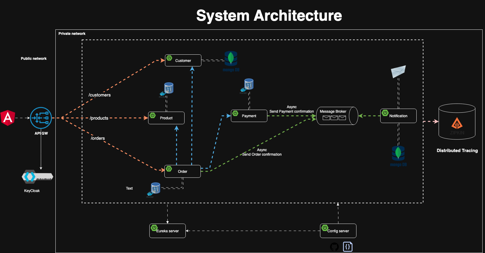

The platform consists of multiple services communicating via REST and Kafka. Core infrastructure services include service discovery, API gateway, centralized configuration, distributed tracing, and authentication.

---

## ⚙️ Tech Stack

| Layer             | Technology                                                             |
| ----------------- | ---------------------------------------------------------------------- |
| Language          | Java 17                                                                |
| Framework         | Spring Boot, Spring Cloud                                              |
| Service Discovery | Eureka                                                                 |
| API Gateway       | Spring Cloud Gateway                                                   |
| Configuration     | Spring Cloud Config Server                                             |
| Communication     | Feign Client (Sync), Kafka (Async)                                     |
| Database          | PostgreSQL (Product, Order, Payment), MongoDB (Customer, Notification) |
| Persistence       | Spring Data JPA & Spring Data MongoDB                                  |
| Containerization  | Docker                                                                 |
| Tracing           | Zipkin                                                                 |
| Authentication    | Keycloak                                                               |
| Migrations        | Flyway                                                                 |
| DevOps (Planned)  | Jenkins, Kubernetes (EKS)                                              |

---

## 🧰 Docker Container Status

Below is a snapshot confirming successful startup of all microservices using Docker:

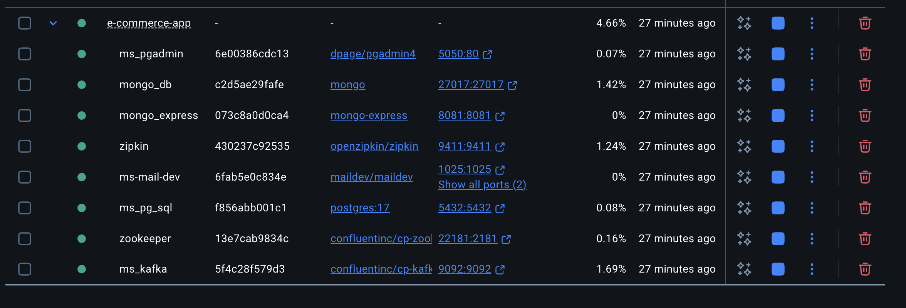

Each container (API Gateway, Eureka, Config Server, Customer, Product, Order, Payment, Notification, Keycloak, Zipkin) is independently containerized and orchestrated using Docker Compose, ensuring reliable and isolated environments during development and testing.

---

## 📐 Design Patterns Applied

- **N-Tier Architecture**: Logical separation of presentation, service, and data access layers
- **Producer-Consumer Pattern**: Asynchronous messaging using Kafka topics
- **DTO Pattern**: Encapsulation of data transfer between layers and services
- **Centralized Configuration**: Externalized config management via Config Server
- **Service Discovery Pattern**: Dynamic service registration with Eureka

---

## 🧩 Microservices Overview

| Service                  | Responsibility                                        |
| ------------------------ | ----------------------------------------------------- |
| **API Gateway**          | Routes and secures client requests                    |
| **Config Server**        | Centralized configuration management                  |
| **Eureka Server**        | Dynamic service discovery and registration            |
| **Customer Service**     | Handles customer profiles (MongoDB)                   |
| **Product Service**      | Manages product listings (PostgreSQL)                 |
| **Order Service**        | Processes customer orders (PostgreSQL)                |
| **Payment Service**      | Handles payment transactions (PostgreSQL)             |
| **Notification Service** | Sends email alerts (MongoDB, Kafka Consumer)          |
| **Keycloak**             | Manages authentication and authorization (OAuth2/JWT) |

---

## 🔄 Application Flow

### 1️⃣ Order Placement

- `OrderService` receives a new order request.
- Validates the customer via `CustomerService`.
- Checks product availability via `ProductService`.
- If valid, saves order to PostgreSQL and emits an "order" event to Kafka.

### 2️⃣ Payment Processing

- `OrderService` calls `PaymentService` for transaction processing.
- On success, stores payment info and emits a "payment" event to Kafka.

### 3️⃣ Email Notification

- `NotificationService` listens to `order-topic` and `payment-topic`.
- Sends order/payment confirmation emails.
- Saves notification details in MongoDB.

---

## 🔐 Security Model

- All client requests pass through the **API Gateway**.
- **Keycloak** is used for centralized authentication and role-based access control.
- Internal service-to-service communication is secured with JWT tokens.

---

## 🗃️ Database Design

### ER Class Diagram

Structure of main relational entities for transactional data using **PostgreSQL**.

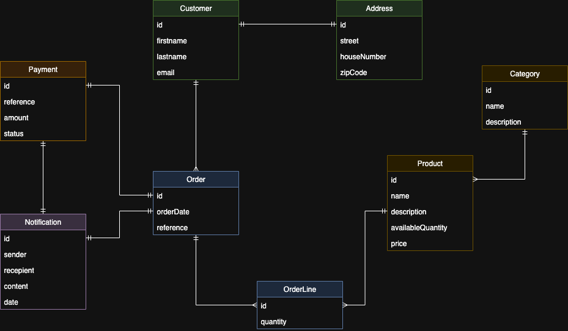

### Domain Diagram

Document structure for user profiles and notifications stored in **MongoDB**.

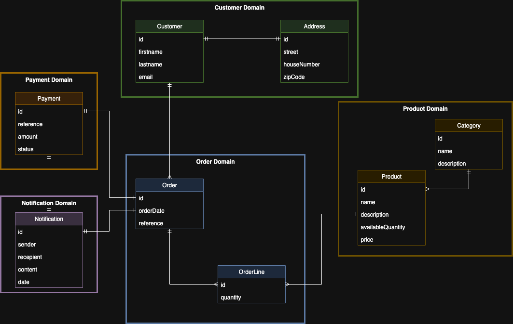

> **Note:**
>
> - **PostgreSQL** is used for transactional services.
> - **MongoDB** is used for managing user profiles and notifications.

---

## 📬 Kafka-Based Messaging

### Producers

- `OrderService` → sends to `order-topic`
- `PaymentService` → sends to `payment-topic`

### Consumer

- `NotificationService` consumes from both topics and triggers email notifications
  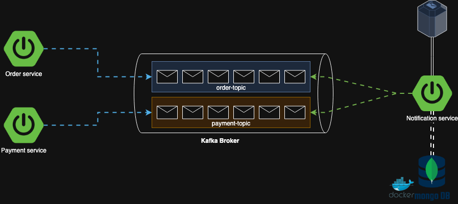

---

## 🖥️ Example Screenshots

### Eureka Dashboard

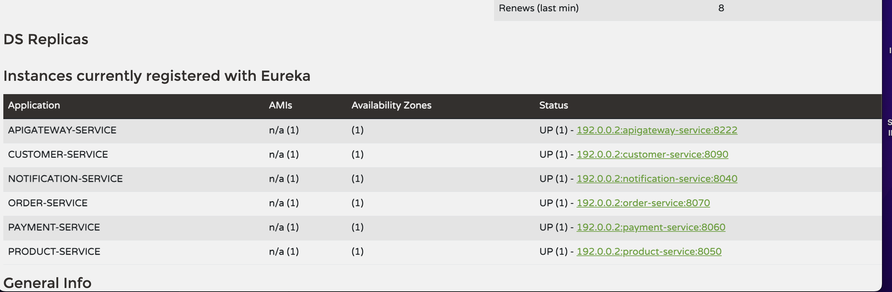

### Keycloak Dashboard

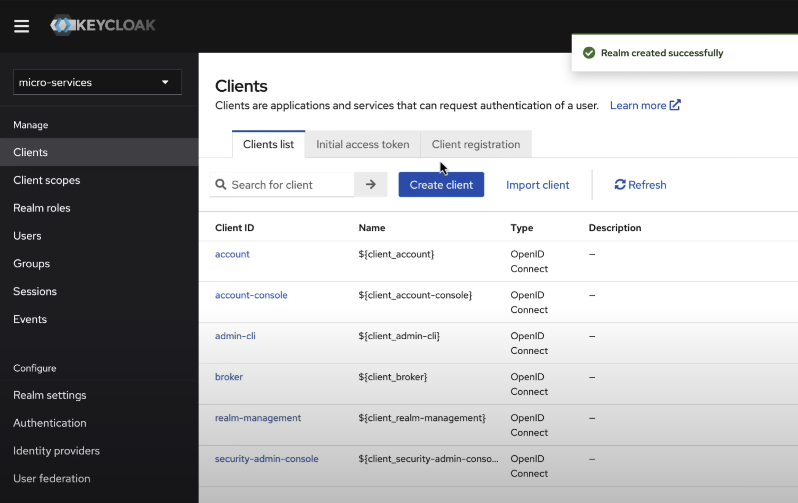

### Zipkin Tracing

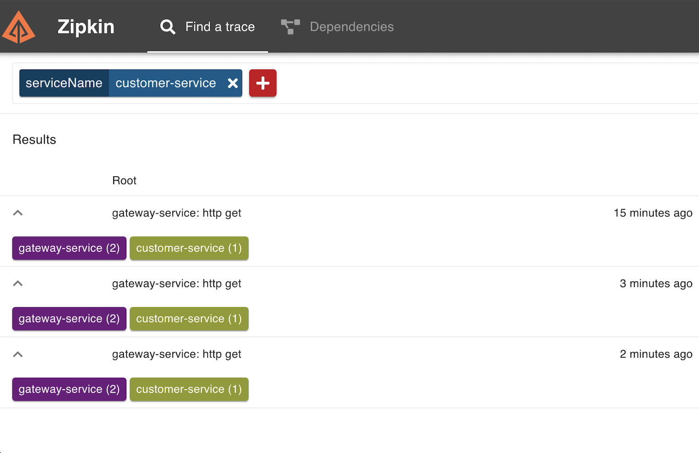

### Customer API Request

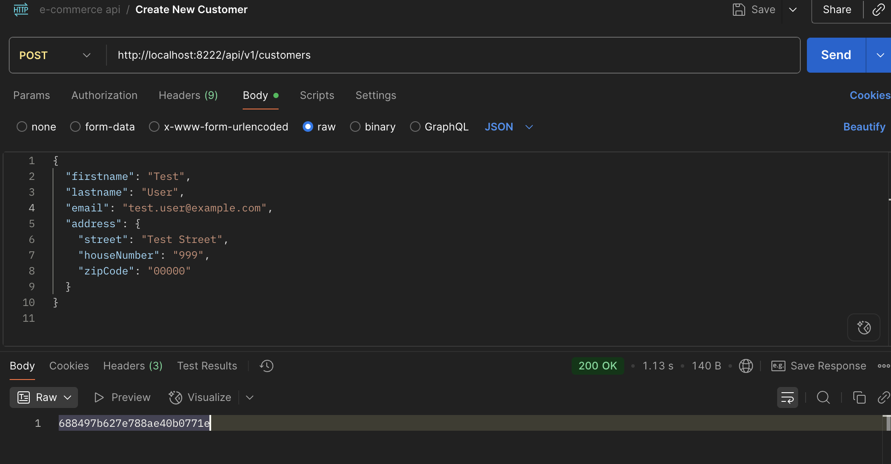

### Product API Request

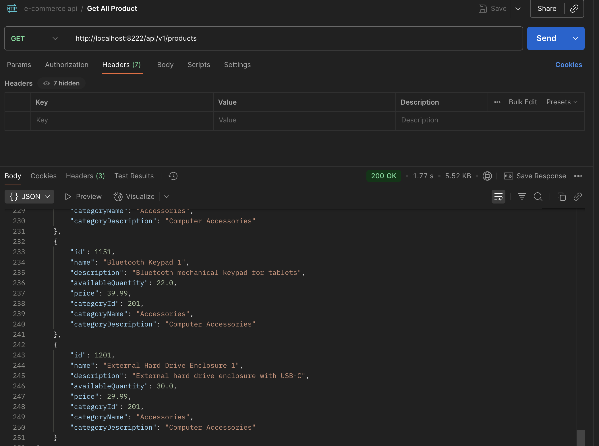

### Order API Request

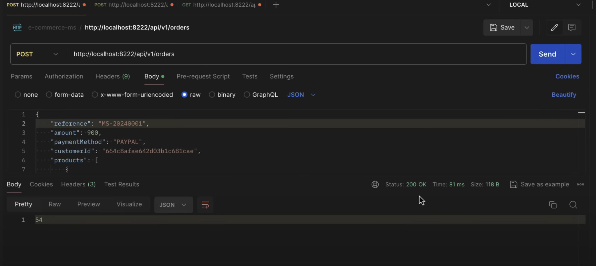

### Order Email Sample

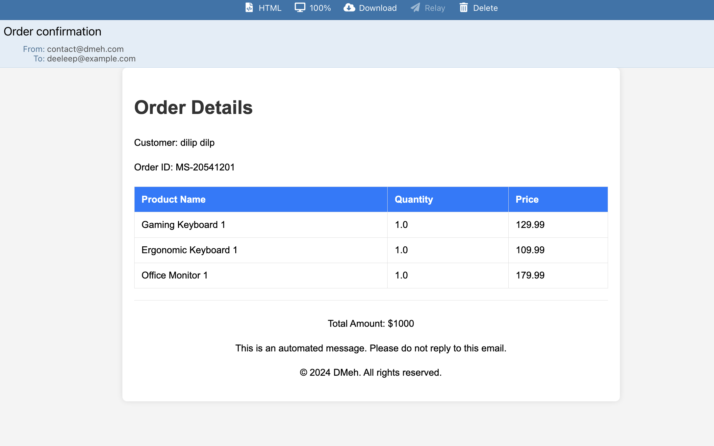

### Payment Email Sample

## 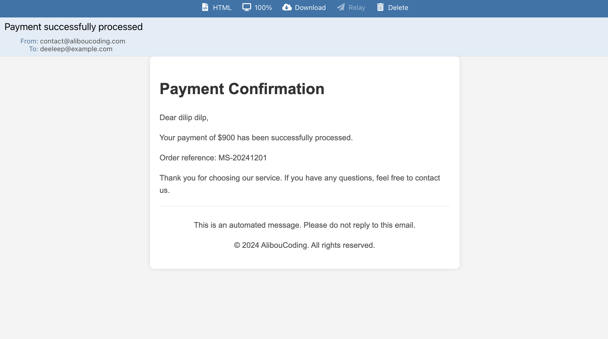

## 🚀 Planned Enhancements

- ⛴ Replace **Eureka** with **Kubernetes-native service discovery** for production deployments
- 🔁 Introduce **CI/CD pipelines** using **Jenkins + Docker + AWS EKS**
- 🔐 Expand **Keycloak** with multi-tenant realms and OAuth2 flows
- 📈 Integrate **Prometheus + Grafana** for monitoring
- 🧪 Add **JUnit & Testcontainers** for integration testing
